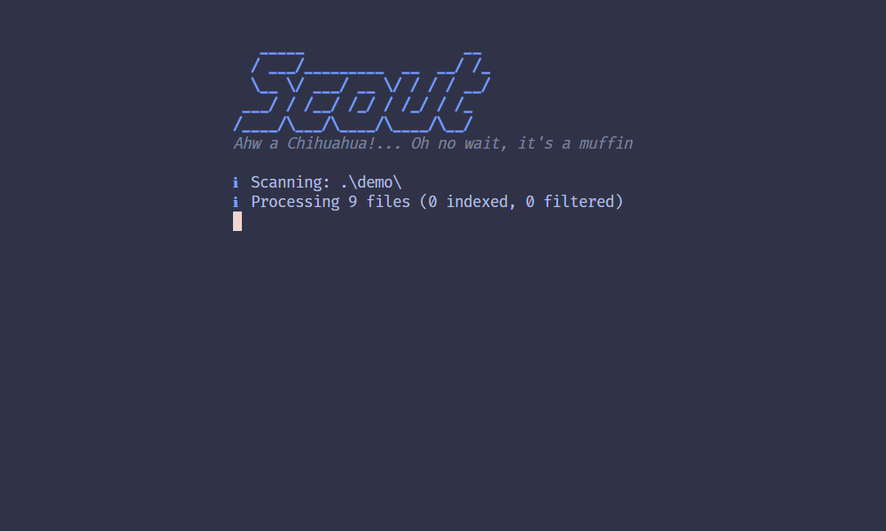

# Scout 🔍

**Semantic image search that actually works locally.**

Find images by what's _in_ them, not what you named the file. No cloud, no API keys, no privacy concerns. Just you, your images, and some clever AI running on your machine.

## Table of Contents

- [What's This About?](#whats-this-about)
- [Why Does This Exist?](#why-does-this-exist)
- [Features](#features-)
- [Quick Start](#quick-start-)
- [Documentation](#documentation-)
- [Usage](#usage)
  - [`scan` - Index Images](#scan---index-images)
  - [`search` - Find Images](#search---find-images)
  - [`watch` - Auto-Index New Files](#watch---auto-index-new-files)
  - [`clean` - Remove Orphaned Sidecars](#clean---remove-orphaned-sidecars)
  - [Global Options](#global-options)
- [Hardware Support](#hardware-support-)
- [Contributing](#contributing)
- [License](#license)

## What's This About?

You know how you take a photo of a cool sunset, name it `IMG_2847.jpg`, and then spend 20 minutes hunting through folders trying to find "that one sunset pic"? Yeah, Scout fixes that.

Type `scout search "sunset over mountains"` and boom - every sunset you've ever photographed, ranked by relevance. Or feed it a reference image with `-i photo.jpg` for reverse image search. Or do _both_ simultaneously and weight them however you want. It's weirdly satisfying.

Scout uses [SigLIP2](https://huggingface.co/onnx-community/siglip2-large-patch16-512-ONNX) vision-language models (the same tech that powers modern AI image understanding) to generate embeddings for your images. These embeddings capture semantic meaning, so "golden retriever" will find your dog photos even if you never tagged them.

## Why Does This Exist?

Look, I'm not going to pretend this is revolutionary. There are probably hundreds of semantic image search tools out there. Some are definitely fancier. Some have better UIs. Some have VC funding and marketing budgets.

But here's the thing: I wanted one that was **fast**, **private**, and **didn't require a PhD to set up**. Something I could point at a folder and just... use. No Docker containers, no Elasticsearch clusters, no "please sign up for our SaaS platform."

Also, I think Rust is neat and wanted an excuse to mess with ONNX Runtime. ✨

So if you're the kind of person who has 10,000+ photos scattered across folders and external drives, and you're tired of macOS Spotlight failing to find anything useful, maybe Scout is for you too.

## Features 🎯

- **📝 Text-based search**: Find images by natural language descriptions
- **🖼️ Image-based search**: Reverse image search using a reference photo
- **🔀 Hybrid search**: Combine text + image queries with adjustable weighting
- **🚫 Negative prompts**: Exclude unwanted content with `--not` flag
- **🎬 Video support**: Index video files by extracting key frames (requires FFmpeg)
- **📁 Recursive scanning**: Index entire directory trees in one go
- **⚙️ Smart filtering**: Exclude videos, set minimum resolution, file size limits
- **🔧 Custom model paths**: Specify custom ONNX models via CLI or environment
- **🚀 Multiple backends**: Auto-detects best hardware (CUDA, TensorRT, CoreML, XNNPACK, or CPU)
- **💾 Sidecar storage**: Embeddings stored alongside images, no central database
- **🔒 Offline everything**: No internet required after initial model download
- **⚡ Fast**: Optimized inference (~50-200ms per image depending on hardware)
- **🌐 Cross platform**: Works on Linux, macOS, Windows
- **📦 Portability**: Move/copy images and `.scout/` sidecars travel with them
- **👁️ Watch mode**: Monitor directories and auto-index new files as they arrive
- **🏷️ Rename immunity**: Files identified by content hash, not filename - rename freely!

## Demo



## Quick Start 🚀

### 1. Install

```bash
git clone https://github.com/Hyphonical/Scout.git
cd scout
cargo build --release
```

Binary at `target/release/scout` (or `scout.exe` on Windows).

### 2. Get Models

Download three model files into `models/` directory:
- `vision_model_q4f16.onnx` (175 MB)
- `text_model_q4f16.onnx` (665 MB)  
- `tokenizer.json` (33 MB)

**→ Full download instructions: [docs/MODELS.md](docs/MODELS.md)**

### 3. Index and Search

```bash
# Index all images (recursive)
scout scan -d ~/Photos -r

# Text search
scout search "cat sleeping on keyboard" -d ~/Photos

# Image search
scout search -i reference.jpg -d ~/Photos
```

## Documentation 📚

- **[Getting Started](docs/getting-started.md)** - Installation, model setup, first steps
- **[User Guide](docs/user-guide.md)** - Comprehensive feature documentation
- **[Architecture](docs/architecture.md)** - Technical deep dive
- **[Contributing](docs/contributing.md)** - Developer guide
- **[Models](docs/MODELS.md)** - Model download and alternatives
- **[Video Support](docs/INSTALL_FFMPEG.md)** - FFmpeg installation guide
- **[Sidecar Format](docs/SIDECAR.md)** - Storage format details

## Usage

### `scan` - Index images

```bash
scout scan [OPTIONS]

Options:
  -d, --dir <PATH>              Directory to scan [default: .]
  -r, --recursive               Scan subdirectories
  -f, --force                   Reprocess already-indexed files
  --exclude-videos              Skip video files
  --min-width <PIXELS>          Minimum image width
  --min-height <PIXELS>         Minimum image height
  --min-size <KB>               Minimum file size in KB
  --max-size <MB>               Maximum file size in MB
```

**Examples:**
```bash
# Basic recursive scan
scout scan -d ./photos -r

# Exclude videos
scout scan -d ./photos -r --exclude-videos

# With filtering
scout scan -d ./photos -r --min-width 512 --max-size 50
```

### `search` - Find images

```bash
scout search [QUERY] [OPTIONS]

Options:
  -i, --image <PATH>            Reference image for similarity search
  -w, --weight <0.0-1.0>        Text weight in combined search [default: 0.5]
  -d, --dir <PATH>              Directory to search [default: .]
  -r, --recursive               Search subdirectories
  -n, --limit <N>               Max results to show [default: 10]
  -s, --score <FLOAT>           Minimum similarity score [default: 0.0]
  --not <QUERY>                 Negative prompt to exclude content
  --include-ref                 Include reference image in results
  -f, --format <FORMAT>         Output format: pretty, json, plain
```

**Examples:**

```bash
# Text search
scout search "beach sunset" -d ~/Photos -r

# Image search
scout search -i reference.jpg -d ~/Photos

# Combined (30% text, 70% image)
scout search "red car" -i ferrari.jpg -w 0.3

# With negative prompt
scout search "woman on beach" --not "dog with frisbee"
```

### `clean` - Remove orphaned sidecars

```bash
scout clean [OPTIONS]

Options:
  -d, --dir <PATH>     Directory to clean [default: .]
  -r, --recursive      Clean subdirectories
```

Deletes `.scout/` sidecar files for images that no longer exist.
`watch` - Auto-index new files

```bash
scout watch [OPTIONS]

Options:
  -d, --dir <PATH>              Directory to watch [default: .]
  -r, --recursive               Watch subdirectories
  --exclude-videos              Skip video files
  --min-width <PIXELS>          Minimum image width
  --min-height <PIXELS>         Minimum image height
  --min-size <KB>               Minimum file size in KB
  --max-size <MB>               Maximum file size in MB
```

Monitors a directory for new or modified media files and automatically indexes them in real-time. Perfect for download folders, camera uploads, or ongoing projects.

**How it works:**
- Watches for file system changes (new files, copies, moves)
- Automatically processes qualifying media files
- Hash-based deduplication - files already indexed are skipped
- Queued processing to avoid CPU spikes
- Runs continuously until stopped with `Ctrl+C`

**Examples:**

```bash
# Watch current directory
scout watch

# Watch with recursive monitoring
scout watch -d ~/Pictures -r

# Watch with filters
scout watch -d ~/Downloads --exclude-videos --min-width 512
```

**Rename Immunity:** Scout now identifies files by their content hash (first 64KB), not by filename. This means you can:
- Rename files freely without losing their index
- Move files between folders (with their `.scout/` sidecars)
- Reorganize your library without re-scanning
- Search will always find the current filename via hash lookup


### Global options

```bash
-v, --verbose                  Show debug output
-p, --provider <TYPE>          Force execution provider [auto,cpu,cuda,tensorrt,coreml,xnnpack]
--model-dir <PATH>             Custom model directory
--ffmpeg-path <PATH>           Custom FFmpeg executable path
```

**Examples:**

```bash
# Use custom models
scout search "cat" --model-dir ./my_models

# Force CPU execution
scout scan -d ./photos --provider cpu --verbose
```

## Hardware Support ⚡

Scout auto-detects the best execution provider for your hardware:

| Provider | Hardware | Performance |
|----------|----------|-------------|
| **TensorRT** | NVIDIA GPUs (RTX series) | Fastest (50-100ms/image) |
| **CUDA** | NVIDIA GPUs | Very fast (80-150ms/image) |
| **CoreML** | Apple Silicon (M1/M2/M3) | Very fast (80-150ms/image) |
| **XNNPACK** | ARM/x64 CPUs | Moderate (200-400ms/image) |
| **CPU** | Fallback | Slower (500-1000ms/image) |

Override with `--provider <type>` if needed. Use `--verbose` to see which provider is active.

## How It Works 🧠

1. **Scanning**: Resizes images to 512×512, generates 1024-dimensional embeddings using SigLIP2
2. **Storage**: Embeddings saved as `.msgpack` files in `.scout/` folders (see [docs/SIDECAR.md](docs/SIDECAR.md))
3. **Searching**: Query converted to embedding, compared via cosine similarity
4. **Ranking**: Results sorted by similarity score (dot product of normalized vectors)

Models are quantized to Q4F16 (4-bit weights, FP16 activations) for speed/size/accuracy balance.

## Contributing

PRs welcome! See [docs/contributing.md](docs/contributing.md) for developer guide.

## License

This project is licensed under the MIT License. See the [LICENSE](LICENSE) file for details.

---

Made with ☕ and Rust. If you have 10,000 photos named `IMG_XXXX.jpg`, this is for you.
